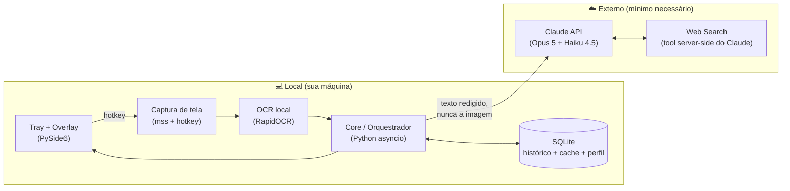

# Candidate Copilot — Assistente de Processos Seletivos

> Projeto de design/arquitetura de um assistente desktop que analisa o conteúdo da tela durante candidaturas a vagas, entende o contexto da vaga e da empresa, e **sugere** respostas personalizadas — sempre com revisão humana antes do uso.

Este repositório contém o **projeto de software completo** (arquitetura, stack, pipeline de IA, segurança, MVP e roadmap) para construir a ferramenta como projeto de portfólio sério.

## Visão geral em 30 segundos

```
Hotkey → Captura de tela → OCR local → Detecção da pergunta → Contexto da vaga
      → Pesquisa sobre a empresa (com cache) → LLM (com perfil verificado)
      → Sugestão + justificativa → VOCÊ revisa, edita e decide usar
```

- **Discreto**: roda na bandeja do sistema; um atalho global captura a tela e um painel pequeno mostra a sugestão. Nada de copiar/colar manual.
- **Local-first**: captura, OCR e armazenamento acontecem na sua máquina. Só texto minimizado e redigido (sem PII desnecessária) vai para APIs externas.
- **Anti-alucinação por design**: o LLM só pode usar fatos do seu perfil (com IDs verificáveis); um passo de verificação bloqueia experiências inventadas.
- **Humano no circuito**: a ferramenta nunca preenche nem envia nada sozinha. Ela sugere; você decide.

## Documentação de projeto

| Doc | Conteúdo |
|---|---|
| [`docs/01-arquitetura.md`](docs/01-arquitetura.md) | Componentes, comunicação, fluxo completo, local vs. nuvem, diagramas |
| [`docs/02-stack.md`](docs/02-stack.md) | Tecnologia por camada, com justificativa de cada escolha |
| [`docs/03-pipeline-ia.md`](docs/03-pipeline-ia.md) | O pipeline de IA etapa por etapa, contratos de dados, contexto da vaga, pesquisa de empresa, geração de resposta e anti-alucinação |
| [`docs/04-privacidade-seguranca.md`](docs/04-privacidade-seguranca.md) | O que fica local, o que sai, redação de PII, armazenamento, controles do usuário |
| [`docs/05-estrutura-projeto.md`](docs/05-estrutura-projeto.md) | Estrutura de pastas/módulos do MVP e evolução |
| [`docs/06-mvp-roadmap.md`](docs/06-mvp-roadmap.md) | MVP priorizado (o que fazer 1º, 2º, 3º), roadmap MVP→V1→V2→avançado, custos, desafios técnicos |
| [`docs/07-uso-responsavel.md`](docs/07-uso-responsavel.md) | Limitações, riscos, regras de plataformas e como o design mitiga mau uso |

## Arquitetura (resumo)



## Decisões arquiteturais principais

| Decisão | Escolha | Por quê |
|---|---|---|
| Linguagem | Python | Sua experiência atual; ecossistema forte em OCR/IA; velocidade de iteração no MVP |
| Forma do app | Monólito modular → depois daemon + UI | Complexidade mínima no MVP; os módulos já nascem com fronteiras que permitem separar processos na V2 |
| OCR | Local (RapidOCR) | Privacidade (a imagem da tela nunca sai da máquina), custo zero, latência baixa |
| LLM | Claude API (Opus 5 para resposta, Haiku 4.5 para classificação) | Qualidade na geração + custo baixo nos passos triviais; structured outputs e prompt caching reduzem erro e custo |
| Pesquisa web | Tool de web search server-side do Claude | Elimina um serviço inteiro (API de busca + scraping + ranking) do seu código |
| Banco | SQLite (+ FTS5) | Local, zero operação, suficiente para um usuário; migração para Postgres só se houver sync multi-dispositivo |
| IPC | Nenhum no MVP (asyncio in-process) → WebSocket na V2 | Não pagar custo de infraestrutura antes de precisar |
| Anti-alucinação | Perfil como base de fatos com IDs + citação obrigatória + passo verificador | O modelo não pode afirmar nada sobre você que não aponte para um fato real do seu perfil |
| Envio de respostas | Nunca automático | Controle do usuário e uso responsável: a ferramenta redige, você revisa e envia |

## Status

📐 Fase de projeto — a implementação segue o plano em [`docs/06-mvp-roadmap.md`](docs/06-mvp-roadmap.md).
