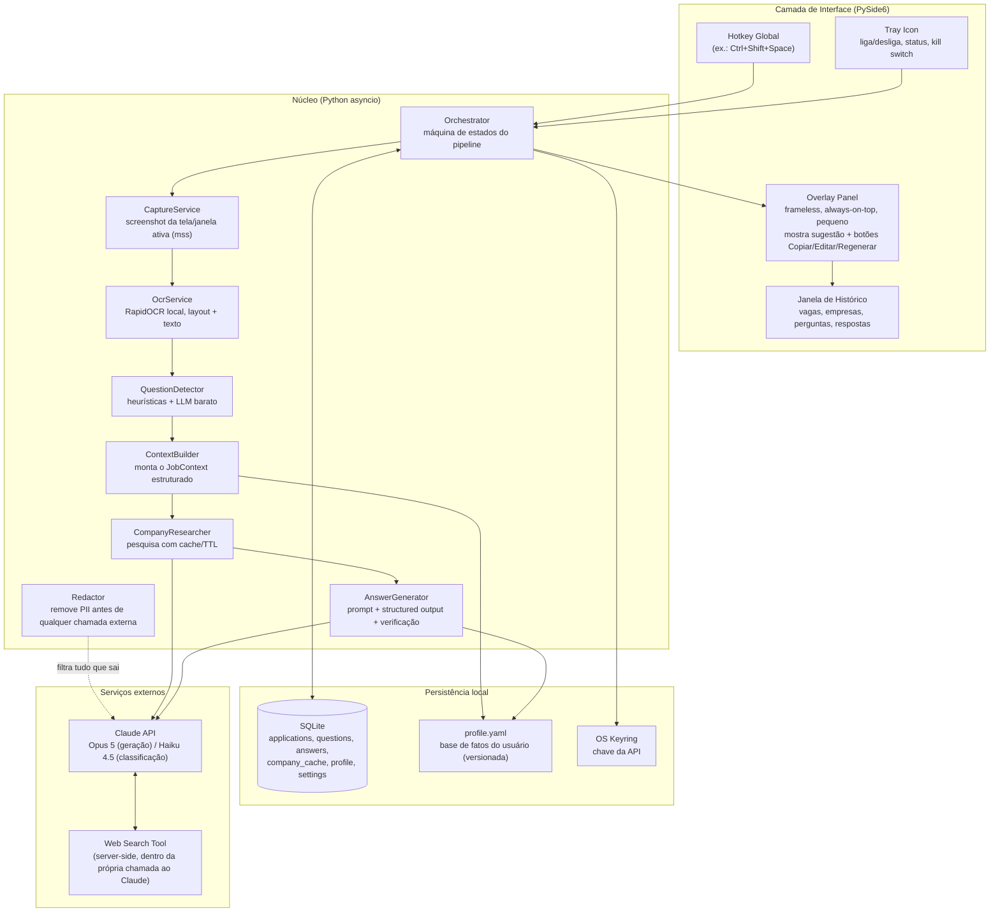
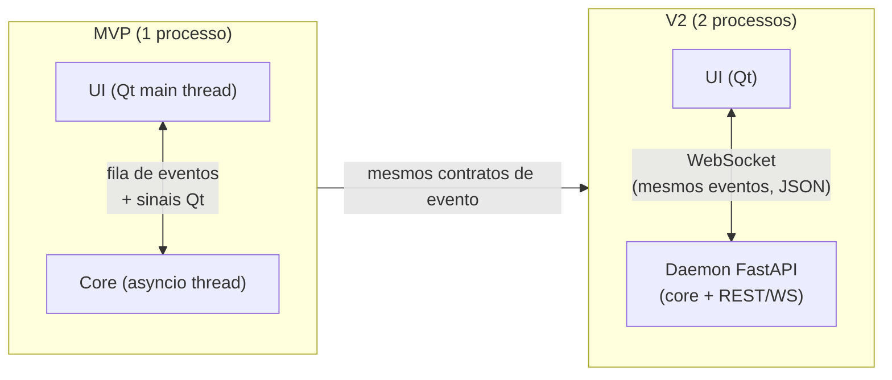
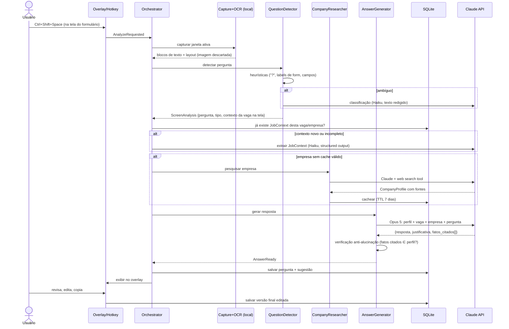

# 01 — Arquitetura Geral

## 1. Princípios que guiam o desenho

Antes dos componentes, as quatro restrições que moldam tudo:

1. **Discrição**: interferência mínima na tela e no fluxo. Isso descarta apps de janela grande e favorece *tray icon + hotkey global + overlay pequeno*.
2. **Local-first**: a imagem da tela é o dado mais sensível do sistema. Ela **nunca** sai da máquina. Só texto já filtrado e redigido vai para APIs.
3. **Humano no circuito**: o sistema sugere; o usuário revisa, edita e cola. Não há automação de preenchimento ou envio.
4. **MVP simples, fronteiras certas**: um único processo Python no início, mas com módulos desenhados de forma que a separação em daemon + UI (V2) seja uma mudança de transporte, não uma reescrita.

## 2. Componentes principais



### Responsabilidade de cada componente

| Componente | Responsabilidade | Onde roda |
|---|---|---|
| **Tray + Hotkey** | Ponto de entrada discreto: ligar/desligar captura, disparar análise, kill switch | Local |
| **Overlay Panel** | Exibir sugestão + justificativa; botões Copiar / Editar / Regenerar / Descartar | Local |
| **Orchestrator** | Máquina de estados: `IDLE → CAPTURING → OCR → DETECTING → RESEARCHING → GENERATING → REVIEW`. Coordena serviços, trata erros, publica eventos para a UI | Local |
| **CaptureService** | Screenshot da janela ativa (ou monitor), metadados da janela (título, processo) para o filtro de escopo | Local |
| **OcrService** | Imagem → blocos de texto com posição (bounding boxes). A imagem é descartada logo após o OCR | Local |
| **QuestionDetector** | Decide: "há uma pergunta de formulário nessa tela? qual?" Heurísticas primeiro, LLM barato quando ambíguo | Local + API (só texto) |
| **ContextBuilder** | Constrói/atualiza o `JobContext` (empresa, cargo, requisitos…) a partir do texto da tela + histórico da sessão | Local + API |
| **CompanyResearcher** | Pesquisa informações públicas da empresa; cacheia por domínio com TTL | API (web search do Claude) |
| **AnswerGenerator** | Prompt final: perfil + vaga + empresa + pergunta → resposta com justificativa e citação de fatos; roda o verificador anti-alucinação | API |
| **Redactor** | Camada obrigatória por onde passa todo texto que sai da máquina: remove e-mails, telefones, CPF, endereços etc. que não pertencem ao processo | Local |
| **SQLite** | Histórico (vagas, perguntas, respostas, edições do usuário), cache de pesquisa, configurações | Local |
| **profile.yaml** | Fonte de verdade sobre você: experiências, projetos, skills — cada item com um ID estável | Local |

## 3. Como os componentes se comunicam

**No MVP: um único processo, comunicação in-process.**

- A UI (PySide6) roda no thread principal (exigência do Qt).
- O pipeline roda em um event loop `asyncio` em thread separado (chamadas de rede e OCR não podem travar a UI).
- A ponte entre os dois é feita por **sinais Qt + uma fila de eventos**: o Orchestrator publica eventos tipados (`PipelineStarted`, `QuestionDetected`, `AnswerReady`, `PipelineError`) e a UI apenas os consome. A UI nunca chama serviços diretamente — só o Orchestrator.

Esse desacoplamento por eventos é a decisão que torna a evolução barata: na V2, quando o núcleo virar um daemon separado, os mesmos eventos passam a trafegar por **WebSocket** (FastAPI no daemon) em vez de fila em memória. A UI não muda de modelo mental, só de transporte.



## 4. Fluxo completo: da captura à sugestão



**Latência alvo** (percepção de fluidez): captura + OCR < 1 s; detecção < 1 s; geração 3–10 s (com streaming no overlay, o usuário vê a resposta nascendo — a percepção de espera cai muito). Pesquisa de empresa é o passo lento (10–30 s), por isso é **cacheada e disparada de forma antecipada**: na primeira captura de uma vaga, a pesquisa começa em background antes mesmo de o usuário chegar às perguntas dissertativas.

## 5. O que roda local × o que vai para APIs

| Etapa | Onde | Justificativa |
|---|---|---|
| Captura de tela | **Local** | Dado mais sensível; nunca sai |
| OCR | **Local** | Evita enviar screenshot para nuvem; custo zero; rápido o suficiente |
| Heurísticas de detecção | **Local** | Regex/regras não precisam de modelo |
| Redação de PII | **Local** | Precisa acontecer *antes* de qualquer saída |
| Classificação de pergunta (casos ambíguos) | **API (Haiku)** | Modelo pequeno, centavos, só recebe texto redigido |
| Extração do JobContext | **API (Haiku)** | Extração estruturada é onde LLM pequeno brilha |
| Pesquisa de empresa | **API (Claude + web search)** | Precisa de acesso à web; server-side elimina infra própria |
| Geração da resposta | **API (Opus 5)** | Qualidade da escrita é o coração do produto |
| Verificação anti-alucinação | **Local + API (Haiku)** | Checagem de IDs é local; julgamento semântico usa modelo barato |
| Histórico, cache, perfil | **Local (SQLite/YAML)** | Privacidade e simplicidade |

> **E um LLM 100% local (Ollama)?** É uma opção deliberada de V2+ para os passos de classificação/extração (privacidade máxima), mas não para a geração: modelos locais de 7–13B ainda escrevem respostas visivelmente piores, e a qualidade da resposta é o produto. Ver `docs/06-mvp-roadmap.md`.

## 6. Máquina de estados do Orchestrator

Manter o pipeline como máquina de estados explícita (em vez de uma função longa) compra três coisas: cancelamento limpo (usuário aperta o hotkey de novo ou o kill switch), reentrada (regenerar resposta sem recapturar) e telemetria local (quanto tempo cada etapa leva).

```
IDLE ──hotkey──▶ CAPTURING ─▶ OCR ─▶ DETECTING ─┬─▶ RESEARCHING ─▶ GENERATING ─▶ REVIEW ─▶ IDLE
                                                │        ▲  (cache hit pula)        │
                                                │        └──────── regenerar ◀──────┘
                                                └─(nenhuma pergunta)─▶ IDLE + aviso discreto
   qualquer estado ──kill switch──▶ IDLE (cancela tarefas, descarta capturas)
```

## 7. Por que *não* algumas alternativas óbvias

- **Extensão de navegador lendo o DOM** em vez de OCR: daria texto perfeito em formulários web, mas (a) não generaliza para apps desktop/PDF/plataformas que bloqueiam extensões, (b) o requisito foi análise de tela. Fica registrada como **fonte alternativa de captura na V2** — a arquitetura aceita, porque `ScreenAnalysis` é um contrato: qualquer produtor (OCR ou DOM) pode alimentá-lo.
- **Electron/Tauri**: UI bonita, mas adiciona um runtime JS/Rust inteiro a um projeto de um desenvolvedor Python. PySide6 entrega tray + overlay nativo no mesmo processo.
- **Backend na nuvem desde o início**: não há necessidade — o app é single-user e local. Nuvem só entraria para sync multi-dispositivo (fase avançada), e aí sim com autenticação.
- **Redis/fila externa**: cache com TTL em SQLite + dicionário em memória resolve; um processo não precisa de broker.
- **Captura contínua da tela (screen watching)**: gravaria tudo o tempo todo — péssimo para privacidade e CPU. O modelo *hotkey-first* captura só quando o usuário pede; um modo semi-automático (diff de tela dentro de janelas permitidas) é opt-in de V2. Ver `docs/04-privacidade-seguranca.md`.
